## MDDN 242 2024 Assignment 2
# MDDN242 Project 2  ————  Blue Papillon
**Student Name**: Pengyuan Zhang
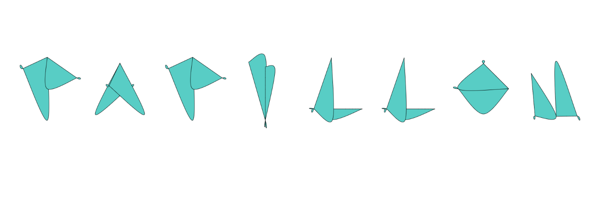

## Design Intent
### Project name: Blue Papillon
"Papillon" means "butterfly" in French, and this typeface is inspired by the lightness and elegance of butterflies. Through the innovative use of simple geometric forms, each letter is not just a static symbol, but a butterfly that spreads its wings and flies.
### Design Concept
The core design concept of this project is to explore the changes in the shape of letters through a dynamic interactive experience that simulates the fluttering gesture of a butterfly. Each letter consists of two overlapping arcs that change shape by adjusting 12 parameters, which visually create the dynamic effect of butterfly wings flapping.

### Letter structure

Each letter is controlled by 12 parameters distributed among six key points, each containing two parameters: "ang" (angle) and "dist" (distance from the centre). These parameters are carefully tuned to allow the letters to visually display a dynamic effect similar to the flapping of a butterfly's wings.

### Parameterisation of points

Point One and Point Two  (and so on up to Point Six).

Ang: defines the angle between the line from the centre of the point and the horizontal line, which controls the direction of the start and end of the arc.

Dis: the distance from the centre to the point, affects the size and shape of the arc.

### Visual Style
A fresh blue tone was chosen to symbolise the butterfly's light flight and free spirit. The font design shows a harmonious and dynamic visual effect through smooth lines. The transformation of each letter delicately simulates the fluttering of the butterfly's wings, so that the whole font not only carries the function of words, but also contains artistic expression.

## Sketch.js - The Transformation of Design

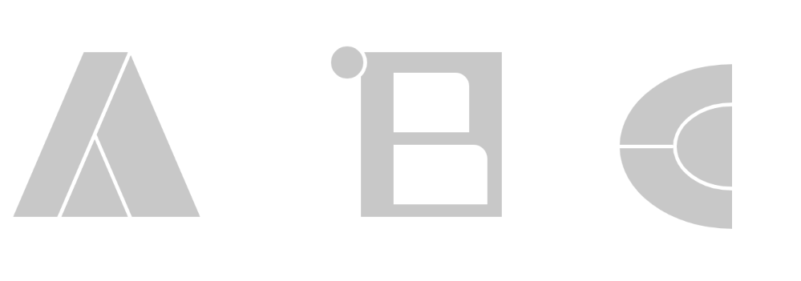

Here I have defined three letters (A, B and C) and then drawn these letters on the canvas.

1. first defines the width and height of the canvas.

2. then defines the shape data for the three letters (A, B, C), including the ellipse size, rectangle width, height, drawing method, etc.

3. in the "setup()" function, the canvas is created and the colour of the brush and the line thickness are set

4. the "draw()" function is used to draw letters on the canvas. First empty the canvas, then calculate where the letters should be drawn, and call the "drawLetter" function to draw the letters.

5. The "drawLetter" function is used to draw a letter at a given location based on the given letter data.

The project began as an exploration of figurative typographic forms, with the intention of creating an easily recognisable and aesthetically pleasing typeface. However, during the sketch phase of the project, I realised that traditional figurative design lacked enough dynamism and interactive fun.

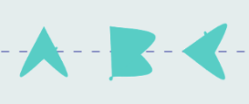

This shift in understanding came from my observation of the work of previous students, whose designs allowed letters to be split and reorganised under keyboard manipulation, a fascinating change that resembled a butterfly flying freely in the sky. So I decided to use two arcs to build up each letter, and chose blue as the main colour of the design to symbolise freedom, romance and unlimited possibilities, all of which are emotions conveyed by the butterfly image.

## Alphabet.js
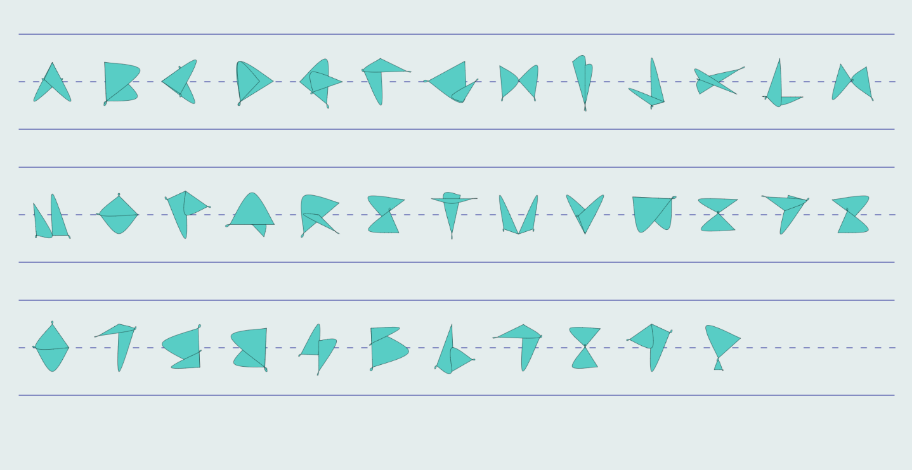

## Drawletter.js 

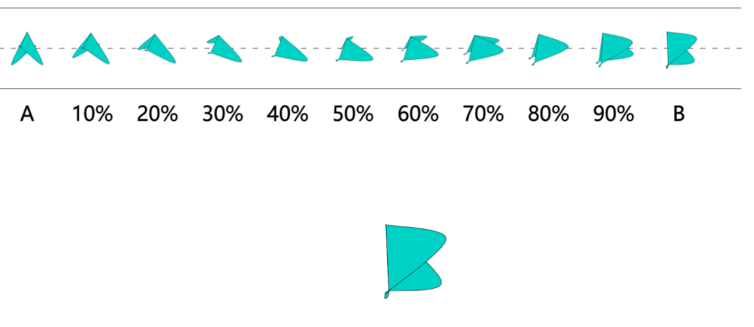

 ### DrawLetter function.  

 Use this function to draw letters. It accepts a data object for the letter as an argument and then draws the shape of the letter based on that data. Specifically, beginShape() and endShape(CLOSE) are used here to draw a closed curve shape representing the outline of the letter.

### Interpolate_letter function.   

This function is used to interpolate between two different states of the letter data. It accepts a percentage parameter, and two letter data objects, and then interpolates between the two states according to the percentage to get a new letter data object. This function is used in animation or transition effects, such as smooth transitions from one letter state to another.

## Issues and improvements

### About the number 3

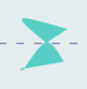  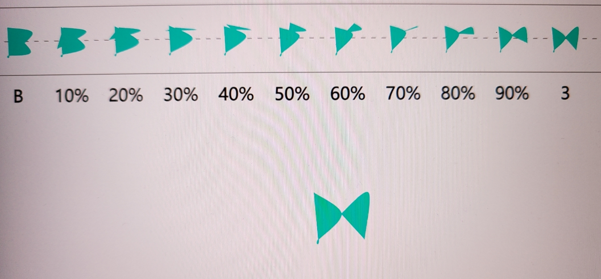 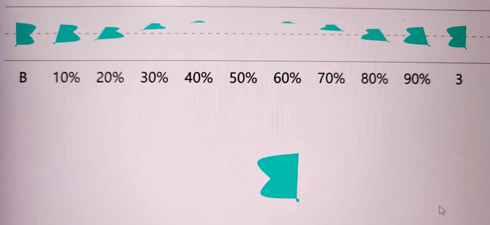

Regarding the readability of the number three, I revised it three times. It was finally decided to make it a mirrored B. This makes a relatively clear distinction between the 3 and the B.

### Make the butterfly more vivid - Add borders.

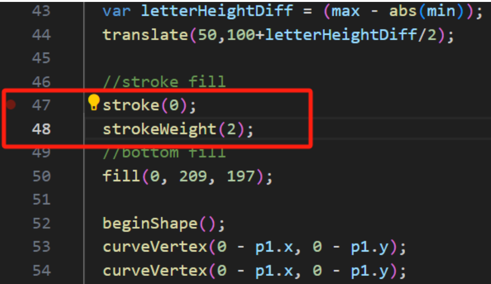

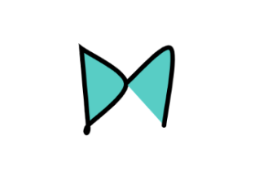

Initially the border didn't wrap around the entire letter and became usable after the modification.
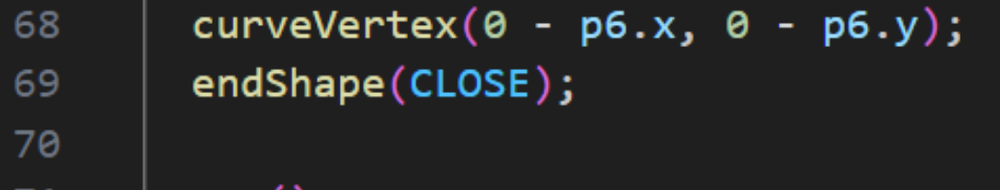

The outlined butterflies appear more delicate and invariably add visual weight, and to achieve balance I made the bezel relatively thin. Set the value to 0.5.

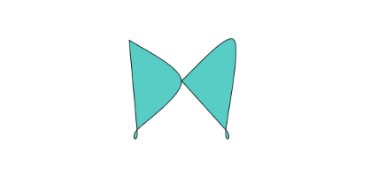

